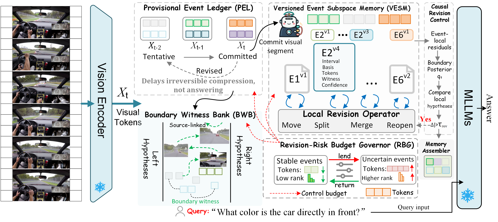
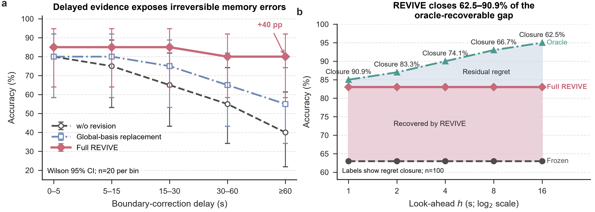
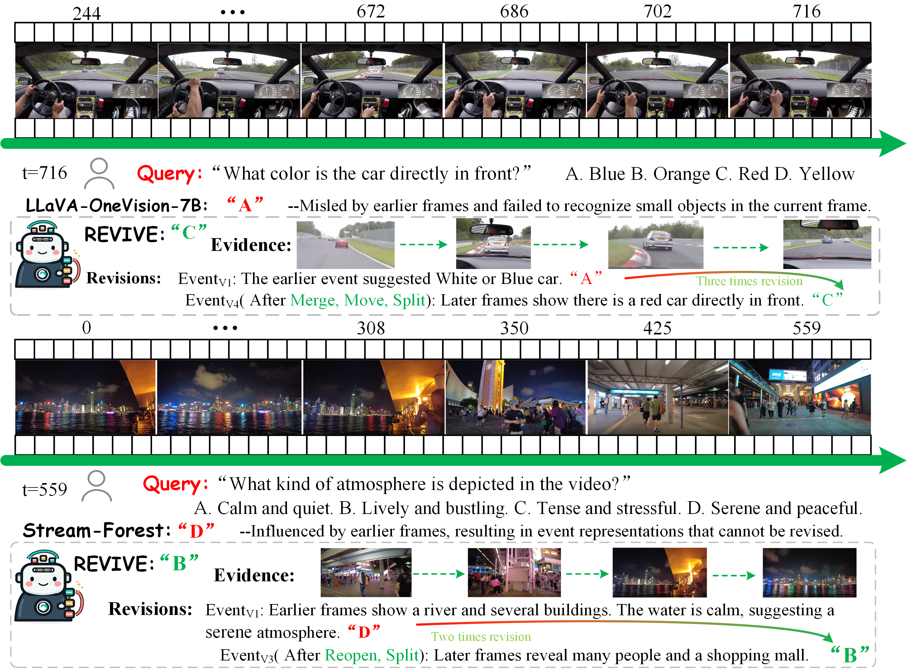

# REVIVE

**Revisable Event Memory for Training-Free Streaming Video Understanding**

REVIVE is a training-free visual-memory controller for streaming video understanding. It is designed for settings in which a frozen multimodal large language model must answer questions over an evolving video stream under a fixed memory budget.

Instead of treating an online event boundary as permanent, REVIVE represents the observed past as a versioned event belief state. Later frames can trigger bounded local revisions of previously committed events, allowing the memory to correct premature segmentation and grouping decisions without retraining the backbone.

> **Release status.** This repository is a compact code preview containing only the two central implementation files. Dataset pipelines, model adapters, experiment scripts, and supporting internal modules are intentionally not included, so this snapshot is not a standalone reproduction package.

## Overview



REVIVE contains four main ideas:

1. **Provisional Event Ledger (PEL).** Recent evidence remains tentative before irreversible compression.
2. **Versioned Event Subspace Memory (VESM).** Each committed event stores its interval, local basis, retained tokens, boundary witnesses, confidence, and version lineage.
3. **Local revision operators.** `Move`, `Split`, `Merge`, and `Reopen` update only the affected event hypotheses when later evidence supports a better structure.
4. **Fixed-budget control.** A revision-risk governor reallocates token and subspace-rank capacity while keeping the total memory budget bounded.

The resulting memory is assembled chronologically and supplied to a frozen MLLM for answer generation.

## Released core code

The complete internal implementation is organized into seven functional modules: `controller`, `state`, `subspace`, `boundary`, `revision`, `witness`, and `budget`. This public preview includes only the following two:

| File | Role |
| --- | --- |
| `Models/REVIVE/controller.py` | Coordinates per-frame updates, provisional evidence, event commitment, accepted revisions, boundary witnesses, budget enforcement, and final memory assembly. |
| `Models/REVIVE/revision.py` | Constructs competing local event hypotheses, evaluates their objectives, and selects bounded `keep/move/split/merge/reopen` decisions. |

The files preserve the original module imports to show their position in the full system. The omitted dependencies are required to execute them.

## Traceable revision provenance

REVIVE records source frame identifiers for retained event-core and boundary-witness tokens. Each revised event also records an event key, version number, parent version, and accepted operation. This produces an auditable event-revision lineage such as:

```text
source frames -> retained core/witness tokens -> E2v1 -> move/merge/reopen -> E2v2 -> final memory
```

This is an event-version provenance chain, not a claim that every generated answer token has a complete causal attribution to one video frame.

## Mechanism diagnostics



The diagnostic view studies delayed evidence and compares frozen event assignments, a global-basis replacement, and full revisable event memory. It also measures how much of the oracle-recoverable gap is closed as additional evidence becomes available.

## Qualitative examples



The examples illustrate how later observations can correct an early event interpretation through local revision while preserving source-linked visual evidence.

## Repository structure

```text
REVIVE_Code/
|-- Models/
|   `-- REVIVE/
|       |-- controller.py
|       `-- revision.py
|-- CaseStudy1.png
|-- line1.png
|-- Overall1.png
|-- README.md
`-- LICENSE
```

## Requirements

The released files are written in Python and PyTorch. In the full research system they are integrated with a frozen vision encoder, multimodal projector, and MLLM inference backend. Exact environment and benchmark scripts are outside the scope of this compact preview.

## License

This code preview is released under the [MIT License](LICENSE).

## Citation

Citation information will be added with the public paper release.
